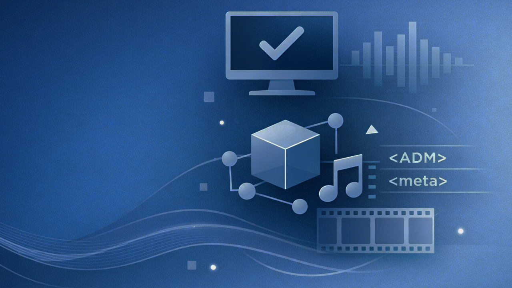
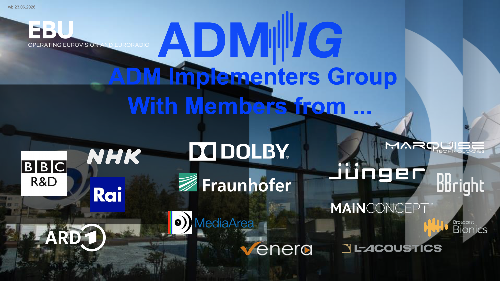

# ADM Implementers Group

## Scope

The ADM Implementers Group is open to EBU Members, industry, and other interested parties. Our aim is to discuss and develop strategies for the broad implementation of the Audio Definition Model (ADM) and its streaming variant (S-ADM) in media production infrastructures and delivery workflows, enabling technical interoperability and reliable content exchange. ADM and S-ADM are the metadata standards that underpin personalised and immersive audio experiences — allowing listeners to adjust dialogue levels, select languages, and access immersive formats.

## Objectives

We build shared knowledge around interactive and immersive sound experiences, promote ADM and S-ADM as the metadata standard for production and emission, define ADM/S-ADM profiles for production and next-generation audio emission, and run interoperability tests. We also develop proof-of-concept projects and conduct trials to advance practical implementation across the industry.

## Background

The EBU has launched the ADM Implementers Group (ADM-IG), a new industry initiative designed to drive the practical deployment of Audio Definition Model (ADM) and Serial ADM (S-ADM) across modern broadcast workflows. Established under the auspices of the EBU, the group provides a structured forum where broadcasters and technology providers can jointly address implementation challenges, with a strong emphasis on interoperability and operational readiness.

The ADM-IG reflects a broader industry shift: while ADM is already standardised and increasingly mandated in delivery specifications, consistent, end-to-end implementation remains uneven. By focusing on real-world integration, from production through to playout and distribution, the group aims to close that gap and accelerate adoption of Next Generation Audio (NGA) capabilities.

A number of technology vendors have joined as founding participants, representing different parts of the audio and media supply chain. These include Ateme, BBright, Jünger Audio, Marquise Technologies and Telos Alliance. Their combined expertise spans encoding, processing, quality control, and monitoring, positioning the group to tackle both technical and workflow-level issues.

Broadcaster engagement is of course central to the initiative. Founding EBU Members currently involved include BBC R&D, BR/ARD and Rai. These organisations have been instrumental in the development of ADM and continue to play a key role in shaping its practical application within production environments.

The group builds on a demonstration of a complete ADM/S-ADM chain at EBU PTS 2026, where partners showcased a full “ADM Studio Set-up” covering ADM file creation, MXF wrapping and quality control, playout server integration, and encoding in both AC-4 and MPEG-H formats. This reference architecture serves as a baseline for ongoing work within the ADM-IG, particularly in validating interoperability between different vendor implementations.

### JOIN ADM-IG

Join-in - Stay informed - Get involved      
Hit the pic.

By registerting you will be added to th ADM-IG mail-reflector and receive general information and invitations to join our regular workstreams calls.

You'll be in good company!

