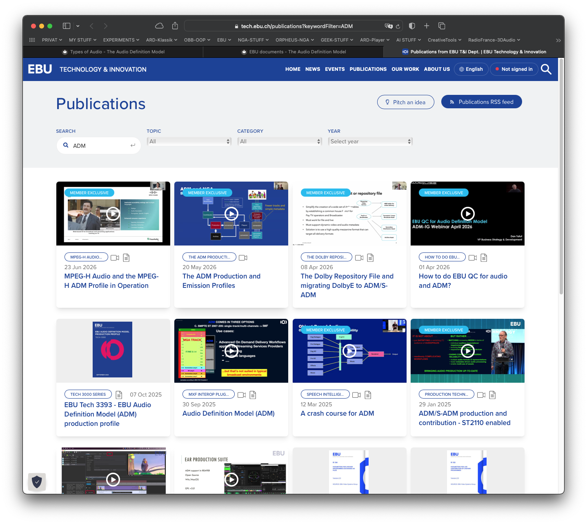

# EBU Documents

  * **[EBU Tech 3392](https://tech.ebu.ch/publications/tech3392)** - EBU Production Profile (deprecated version)    
    This first issue to describe a generic and comprehensive ADM Production Profile from 2018 has been superseded by newer versions of the ADM standard.

  * **[EBU Tech 3393](https://tech.ebu.ch/publications/tech3393)** - EBU Production Profile (active version)    

    The purpose of a profile for the Audio Definition Model (ADM) [ITU-R Recommendation
    BS.2076] is to provide an extra set of restrictions, requirements, and structure to the
    metadata to allow it to be suited to a particular application area. This particular profile
    for BS.2076-3 covers the production application area, where audio and metadata may
    initially be created or edited using production tools.
    The Production Profile has several aims:
        • To give sufficient constraints to allow production tools to be usable and implementable.
        • To be broad enough to allow complex productions to be adequately represented.
        • To have enough flexibility so a single production can be made to cover many different emission platforms and distribution variations.
        • To contain enough information to ensure any subsequent squeezing retains as much as the     original intent of the production as possible.
        • To avoid complex rules that are difficult to implement or interpret

**Hit the pic to access all of EBU's publications on ADM**    

