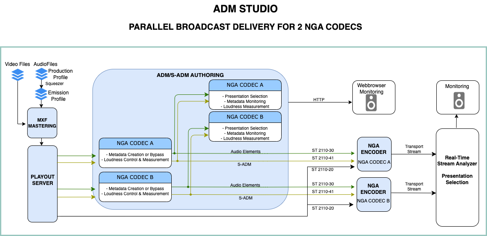
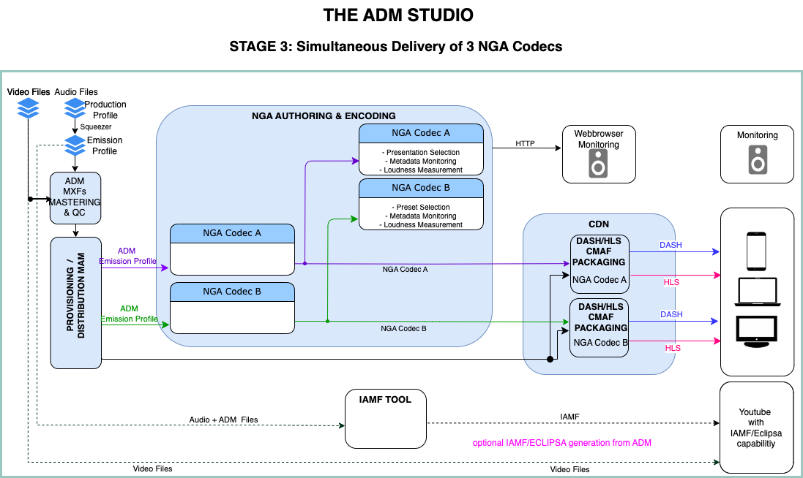

# ADM*2*NGA - The *Step 3*    

The hurdle to use geunine ADM in production has become low, as today's archtitectures and formats already offer ADM capabilities (like in [*SMPTE 2110-31: AES3 in IP*, *2110-41: fast metadata in IP*, *ST 2127-10: S-ADM in MXF* or *ST2131: ADM in MXF*). Also, state-of-the-art DAW and NLE tools can author ADM in various profiles.    
Lots of broadcast productions such as radio dramas, TV movies, Sports events, Shows etc. already use ADM - in the background.    
However, as On-Air and On-Demand distribution chains as well regulatory requirements in countries differ, only a few in Europe (e.g. Poland, Spain, France) have already introuced NGA delivery officially.   

But there's no reason to let that hold you back.   
Take adavantge of leaner track-layouts, versatile routing, and flexible, metadata driven contribution processing.
And fust render the required output formats for different platforms in-house: *Hosted rendering*)

These [**STEP 3**](migration.md) workflows shows the possibilities

### A. On-Air Broadcasting###

### B. On-Demand Streaming###

