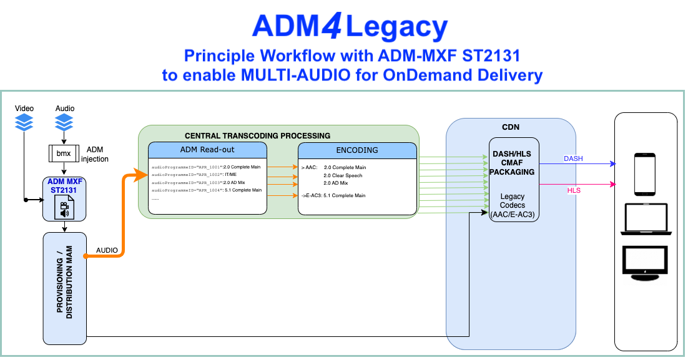

# ADM*4*Legacy - A *Stage 1* Workflows for OnDemand

ADM can enhance "legacy" MXF assets containing channel-based mixes defined in track-allocation tables such as [EBU R123](https://tech.ebu.ch/publications/r123), [ITU-R BS.2102](https://www.itu.int/rec/R-REC-BS.2102/en) or [ARD/ZDF/ORF's Delivery Specifications TPR](https://www.ard.de/die-ard/b2b/tpr-2025-technische-produktionsrichtlinien-zur-herstellung-von-medienproduktionen-100.pdf)
Instead of applying sidecar-files (e.g. the outdated BMF - Broadcast Media ExchangeFormat) or even paper sheets (MBK - Medienbegleitkarte et. al.), ADM wrapped in MXF according to [SMPTE ST 2131](https://pub.smpte.org/doc/st2131/) can carry all necessary information about audio formats (2.0, 5.1), content type (Complete Main, IT/ME...), loudness metadata etc. within the MXF essence.    
This allows more consistent and (semi-)automated workflows for both On-Air and On-Demand distribution pipelines.     
Especially human curated provisioning On-Demand presently lacks solid information about available audio tracks contained in order to trigger the required encoding parameters and enabling MULTI-AUDIO also for HLS and DASH streaming. Thus, audiences cannot benefit from better audio experiences by selecting AD or clear speech dialogue or surround sound when accessing content via streaming.

This [**STEP 1**](migration.md) workflow show the improvements that can be gained

