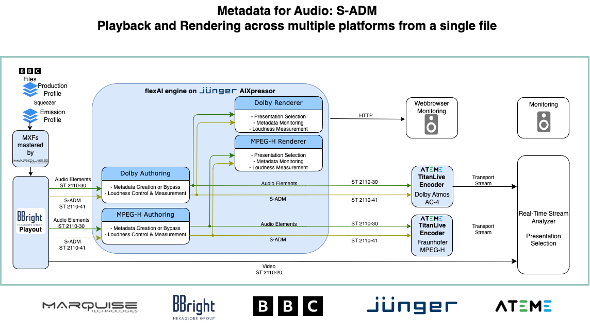
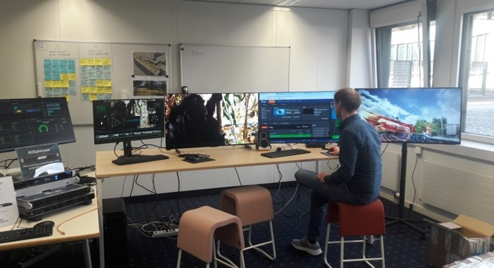

# The ADM Studio - The definitive *Step 3* ADM*2*NGA Workflow

The *ADM Studio Set-up* was first presented at EBU Production Technology Seminar 2026 in Geneva.
It's a complete [**STEP 3**](migration.md) production and play-out chain for ADM and S-ADM including

   - ADM-BW64 audio files according to the *ADM Production Profile*
   - conversion ("squeezing") into the ADM *AdvSS Emission Profile*
   - authoring, muxing with video content into MXF ST2127 and ST2131 and QC
   - forwarding to an ADM/S-ADM compatible Playout System
   - play-out via ST 2110 (audio: ST 2110-30, S-ADM: ST 2110-41, video: ST2110-20)
   - conversion and monitoring for two NGA codecs simultaneously
   - parallel encoding into two NGA codecs
   - playback and analysing of delivered broadcast transport streams

This video explains the set-up as presented at EBU PTS 20260

<!----    SERVES NO AUDIO IN PREVIEW-->

<video width="640" height="480" controls>
  <source src="img/ADM-IG-StudioSetUp-PTS2026-720.mp4" type="video/mp4">
</video>

<!---- would require plug-in to attach and view PDF-->
