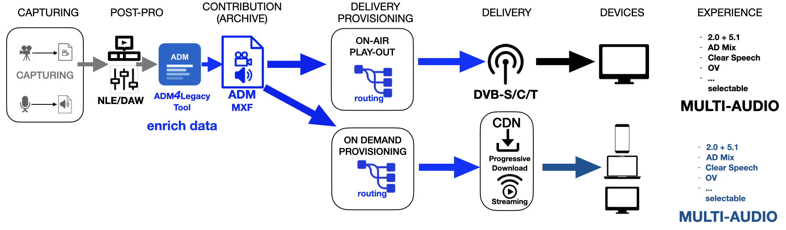
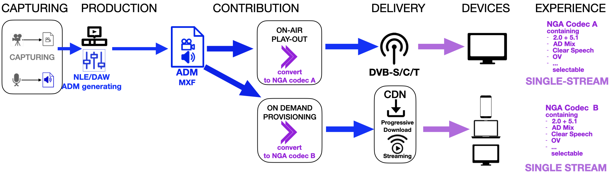

# ADM MIGATION PATH - High Level Views

There are three obvious steps for broadcasters to migrate to ADM.

One-by-one they form a gradual way of implementation and adding complexity
when moving from conventional - "*legacy*" - audio to object-based production and NGA delivery

## STEP 1. ADM*4*Legacy

For existing conventional channel-based production and distribution workflows

  - no object-based/NGA production and rendering required
  - ADM applied only as inherent descriptor for tech specs of file (track-layout, audio format content type, languages, loudness etc.)
  - benefits are:    
     -> no (more) sidecar file workflows or paperwork required    
     -> enabling track-routing and automation in workflows    
     -> driving on-air and on-demand *MULTI-AUDIO* delivery    

->[ADM2Legacy](ADM4Legacy-OnDemand.md) provides more details of this stage.

## STEP 2. ADM*2*Legacy

First migration step to benefit from efficient object-based ADM production techniques - without (yet) NGA delivery options

- ADM/S-ADM applied for genuine object-based mixes
- delivery to conventional, "legacy" channel-based audio codecs requires *hosted ADM rendering*
- benefits are:    
     -> sources and stems kept separately (smaller track counts, re-usability)    
     -> scalable, multiple rendering format as required (2.0, 5.1. 5.1.4, binaural)    
     -> driving on-air and on-demand *MULTI-AUDIO* delivery    

->[ADM2NGA](ADM2Legacy.md) provides more details of this stage.

## STEP 3. ADM*2*NGA

Ultimate move to end-to-end ADM-NGA production and delivery chain.

  - ADM/S-ADM applied for genuine object-based mixes
  - sources and stems kept separately (smaller track counts, re-usability)
  - enabling conversion into mutliple NGA codecs (*AC-4*, *MPEG-H*, *Eclipsa*)
    as required by platforms
  - each NGA audio stream may contain multiple presentations/presets
  - rendering on NGA capable device allows user best possible personalisation for    
     -> Speech Intelligibility    
     -> Multi-Language/Audio Description    
     -> Immersive Reproduction
     -> Loudness Adaptability et. al.    

->The [ADM Studio](ADM_studio.md) is a paradigmatic implementation of this stage.
